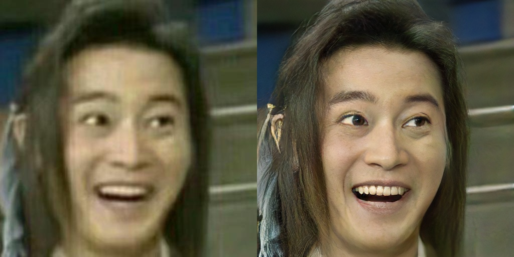

## What is the repository about?

This code is the unofficial implementation of this [**work**](https://github.com/cszn/BSRGAN). Specifically, I coded the pipeline of the whole degradation model according to the configuration given in the [**paper**](https://arxiv.org/abs/2103.14006). Note that some details are different from the original paper (For the sake of simplicity, I've removed the processed camera sensor noise, but this part may be key to the generalization of the network). I chose [**HiFaceGAN**](https://github.com/pkuvcl/Face-Renovation) as the model for restoring the degraded images. I used the code `degrade.py` to generate **10000 degraded face images** in advance. After training with **two V100** on hifacegan for **one day**, the reconstruction effect on the real images I found is much better than the general bicubic degradation method.

## Comparison

The degraded images below are all real images from social networks.

Images layout is `LR | mixed degradation SR`

Images layout is `LR | bicubic degradation SR | mixed degradation SR`

## What else to do？

Compared with the original paper, the size of current training set of my method is relatively small and the training time is relatively short, though it has achieved much better results than the bicubic degradation method. In some real images, there are still some noises that can't be removed, which may be because I didn't use the processed camera sensor noise. In some test images, it is also found that the reconstruction effect of the model for the face area is acceptable, but the reconstruction effect of the background and text is relatively poor, which may be caused by the lack of diversity of the data set itself.